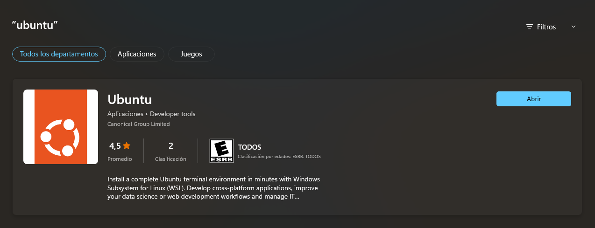

## Install Ubuntu

Download Ubuntu desktop, Ubuntu Server, Ubuntu for Raspberry Pi and IoT devices, Ubuntu Core and all the Ubuntu flavours 

<table align="center">
  <tr>
    <td align="center" style="padding=0;width=50%;">
      
    </td>
  </tr>
</table>

 ⚙ Download The open source Ubuntu desktop operating system powers millions of PCs and laptops around the world. - [Ubuntu](https://ubuntu.com/desktop)

## Install Ubuntu Terminal

<table align="center">
  <tr>
    <td align="center" style="padding=0;width=50%;">
      
    </td>
  </tr>
</table>

 ⚙ Download Install Ubuntu on WSL2 on Windows - [Ubuntu Terminal WSL](https://apps.microsoft.com/store/detail/ubuntu/9PDXGNCFSCZV?hl=en-us&gl=us)

